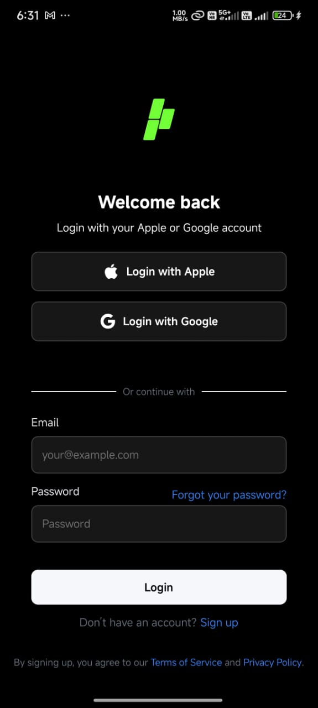
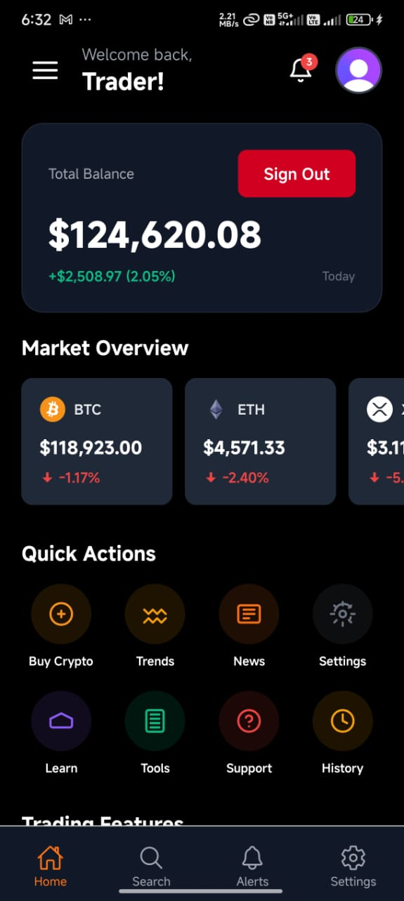
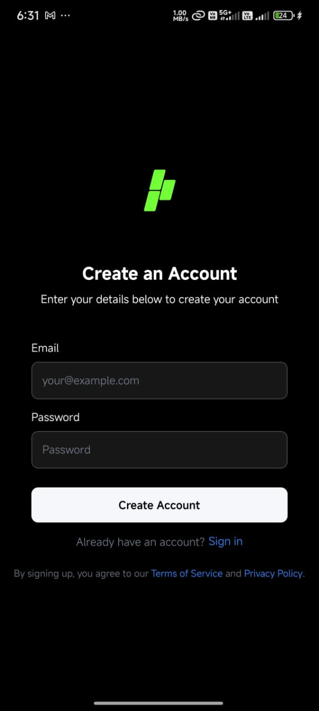
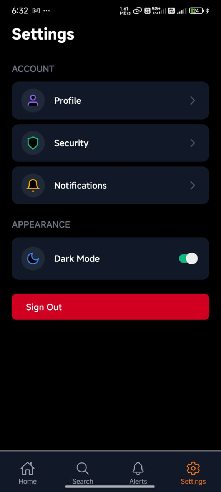
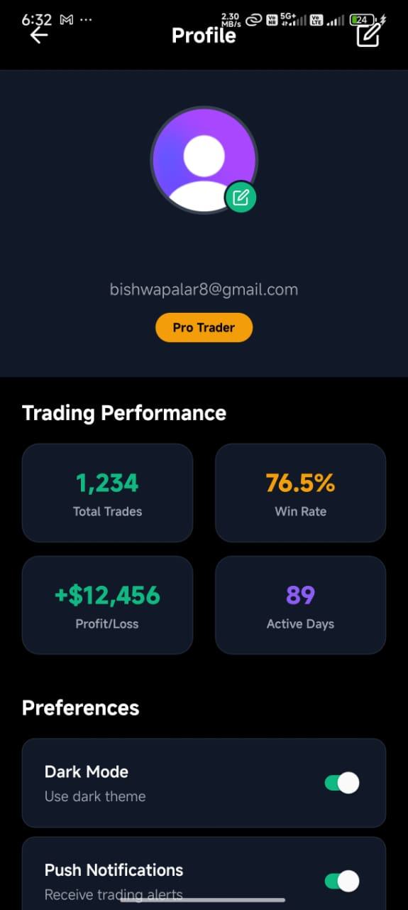
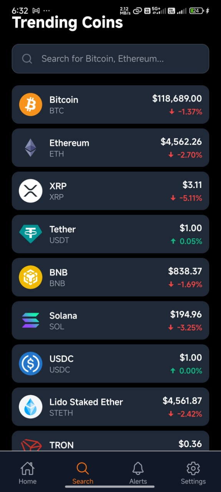
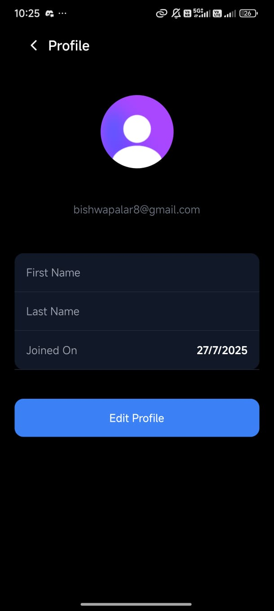
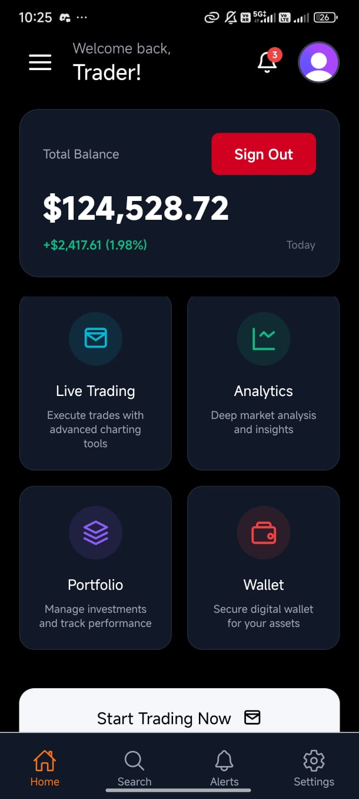
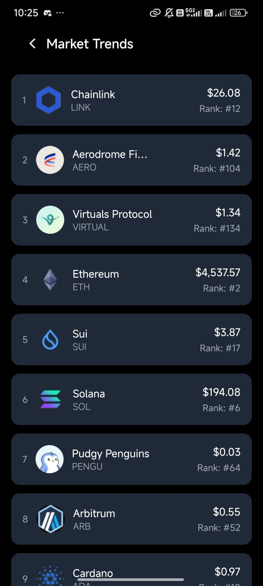

# Project Title

A brief description of what this project does and who it's for

# FinvexTrade 🚀

A comprehensive trading application that combines a React Native mobile app with a robust backend server, providing users with real-time crypto trading capabilities, market analysis, and portfolio management.

## Screenshots

Here are some smaller screenshots from the mobile app:

  
  
  

  
  
  

  
  
   
  

## 🌟 Features

- **📱 Mobile Trading App**: Built with React Native and Expo
- **🔐 User Authentication**: Secure login and profile management
- **💰 Crypto Portfolio**: Real-time portfolio tracking and management
- **📊 Market Data**: Live crypto market prices and trends
- **📰 News Feed**: Latest cryptocurrency and financial news
- **🔔 Alerts & Notifications**: Custom price alerts and trading notifications
- **⚙️ Settings & Preferences**: Customizable user experience
- **🖥️ Backend API**: RESTful API for data management

## 📋 Table of Contents

- [Installation](#installation)
- [Usage](#usage)
- [Project Structure](#project-structure)
- [Screenshots](#screenshots)
- [Contributing](#contributing)
- [License](#license)

## 🚀 Installation

### Prerequisites

Before running this project, make sure you have the following installed:

- [Node.js](https://nodejs.org/) (v14 or newer)
- [npm](https://www.npmjs.com/) (comes with Node.js)
- [Expo CLI](https://docs.expo.dev/get-started/installation/) for mobile development

git clone https://github.com/Bishwa-cyber/finvexatrade-v2.git
cd finvexatrade-v2

### Backend Setup

1. Navigate to the backend directory:

2. Install dependencies:
npm install

3. Create a `.env` file in the backend directory:

Example .env file
PORT=3000
DATABASE_URL=your_database_url
JWT_SECRET=your_jwt_secret

4. Start the development server:
npm run dev

The backend server will start on `http://localhost:3000`

### Mobile App Setup

1. Navigate to the mobile directory:
cd mobile
2. Install dependencies:
npm install

3. Update Expo packages (if needed):
npx expo install --fix

4. Start the Expo development server:
npx expo start

5. Run on your device:
   - **iOS**: Press `i` in the terminal or scan QR code with Camera app
   - **Android**: Press `a` in the terminal or scan QR code with Expo Go app
   - **Web**: Press `w` in the terminal

## 🎯 Usage

### Development

Start backend server
cd backend && npm run dev

Start mobile app (in another terminal)
cd mobile && npx expo start

### Production Build

Build mobile app for production
cd mobile
npx expo build:android # for Android
npx expo build:ios # for iOS

## 📁 Project Structure

finvexatrade-v2/

├── mobile/ # React Native mobile application

│ ├── app/ # App screens and navigation

│ ├── components/ # Reusable UI components

│ ├── assets/ # Images and static files

│ ├── utils/ # Utility functions

│ ├── services/ # API calls and external services

│ └── package.json # Mobile dependencies

├── backend/ # Node.js backend server

│ ├── routes/ # API routes

│ ├── models/ # Database models

│ ├── middleware/ # Custom middleware

│ ├── server.js # Main server file

│ └── package.json # Backend dependencies
│

├── README.md # This file

└── package.json # Root project configuration

## 🖼️ Screenshots

*Add screenshots of your app here*

## 🛠️ Built With

- **Frontend**: React Native, Expo
- **Backend**: Node.js, Express.js
- **Database**: MongoDB/PostgreSQL (specify your choice)
- **Authentication**: JWT
- **State Management**: Redux/Context API (specify your choice)

## 🤝 Contributing

Contributions are what make the open source community such an amazing place to learn, inspire, and create. Any contributions you make are **greatly appreciated**.

1. Fork the Project
2. Create your Feature Branch (`git checkout -b feature/AmazingFeature`)
3. Commit your Changes (`git commit -m 'Add some AmazingFeature'`)
4. Push to the Branch (`git push origin feature/AmazingFeature`)
5. Open a Pull Request

## 🐛 Issues

If you encounter any issues or have suggestions, please [create an issue](https://github.com/Bishwa-cyber/finvexatrade-v2/issues).

## 📝 License

This project is licensed under the MIT License - see the [LICENSE](LICENSE) file for details.

## 👥 Authors

- **Bishwa Bhushan Palar** - *Initial work* - [@Bishwa-cyber](https://github.com/Bishwa-cyber)

## 🙏 Acknowledgments

- Thanks to all contributors who have helped with this project
- Special thanks to the React Native and Node.js communities
- Crypto data provided by various financial APIs

---

⭐ **If you found this project helpful, please give it a star!** ⭐

### Clone the Repository

